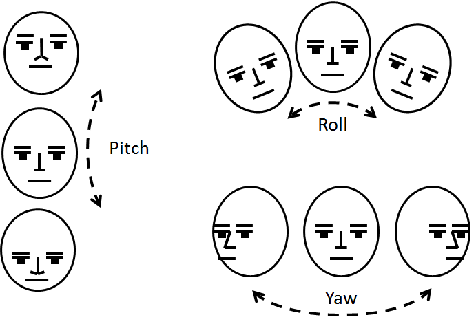
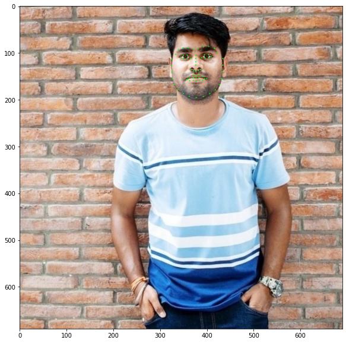

<div align="center">

# Face Pose Detection


</diV>

# Data
You can View the data used for this project [here](./Dataset).

# Folder Structure
Please, use the following folder structure to run all Jupyter Notebooks without any additional effort:

```
├── Dataset
├── Images
├── Models
├── FacePose.ipynb
```

## Result



